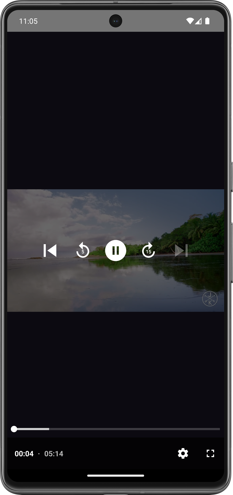

# ExoPlayer in Jetpack compose

This project combines modern Android development practices by using using Media3 ExoPlayer with Jetpack Compose to create an interactive and visually appealing video player application .

- Why Jetpack Media3?
-  We have several existing media APIs: Jetpack Media also known as MediaCompat, Jetpack Media2, and ExoPlayer. These libraries were developed with different goals, and have several areas of overlapping functionality.

It can be challenging to decide which library to use for a given use case, and objects from different libraries are often not compatible, requiring adapters or connecting code. Media3 removes these challenges by providing a single set of libraries which work well together.


## Dependency
```
    implementation("androidx.media3:media3-exoplayer:1.1.0") // [Required] androidx.media3 ExoPlayer dependency
    implementation("androidx.media3:media3-session:1.1.0") // [Required] MediaSession Extension dependency
    implementation("androidx.media3:media3-ui:1.1.0") // [Required] Base Player UI
    implementation("androidx.media3:media3-exoplayer-dash:1.1.0") // [Optional] If your media item is DASH
    implementation("androidx.media3:media3-exoplayer-hls:1.1.0") // [Optional] If your media item is HLS (m3u8..)
    implementation("androidx.media3:media3-exoplayer-smoothstreaming:1.1.0") // [Optional] If your media item is smoothStreaming
```

## ScreenShots
| VideoListing | VideoPlayer| 
| :-------- | :------- | 
|     |   | 


## Badges

Add badges from somewhere like: [shields.io](https://shields.io/)

[](https://choosealicense.com/licenses/mit/)
[](https://opensource.org/licenses/)
[](http://www.gnu.org/licenses/agpl-3.0)


## License

[MIT](https://choosealicense.com/licenses/mit/)

